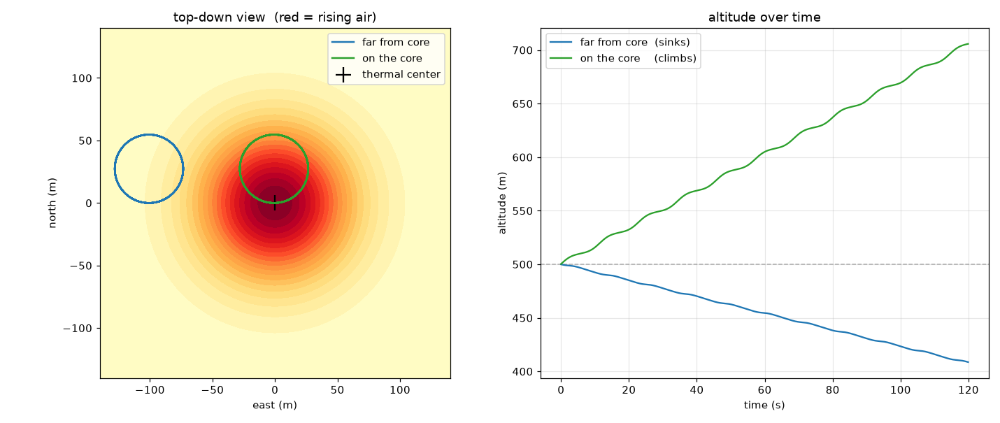

# soaring — a glider-in-a-thermal world-model testbed

A minimal glider sim (pure Python + NumPy) **plus the first predictor trained
on it** (a small PyTorch MLP). The long game: JEPA-style world models —
predict the world's future, then plan through the prediction. The sim is the
little "world"; the experiments below measure whether its future can be
trusted.



## what's here
- `glider_sim.py` — the physics. The only function that matters is `step()`:
  it takes the glider's state + an action (bank angle) and returns the state
  one tick later. Read it top to bottom; it's ~one screen of real code.
- `fly.py` — flies a dumb constant-bank policy (two gliders: one on the
  thermal core, one out in dead air) and saves a plot.
- `data_gen.py` — the sim as a data factory: logs random-policy flights into
  a self-describing `data/dataset.npz` (channel names stored in-file).
- `train.py` — trains the one-step panel predictor + a "blindfolded twin"
  with the lift senses zeroed (the ablation that shows what feeling the air
  is worth).
- `card.py` — the one-step report card: per-channel error vs a dumb baseline.
- `keystone.py` — THE experiment: free-running rollout error vs horizon.
- `report.py` — all the charting behind the above.

## setup (one time, uses `uv`)
```
uv sync
```
Creates `.venv` and installs everything from the lockfile (numpy, matplotlib,
pygame, torch, plus the dev tools the commit gate runs).

## run
```
.venv/bin/python fly.py
```
Writes `soaring_first_flight.png` (top-down paths + altitude-over-time).

## the viewport — watch flights, fly one yourself, or replay the model's imagination
A 3D flight viewer (vector-projected, pygame — no GPU stack) with two modes:

```
.venv/bin/python data_gen.py                # once: build data/dataset.npz
.venv/bin/python -m viewport.app            # REPLAY logged episodes
.venv/bin/python -m viewport.app --fly      # FLY with the arrow keys
```

- **REPLAY**: SPACE play/pause · ←/→ scrub · `,` `.` single-step · ↑/↓ speed ·
  `[` `]` switch episode · `G` ghost predictor · click the timeline to seek.
- **FLY**: ←/→ bank, ↑/↓ speed (pull up = slower — it's a real energy
  exchange, you can stall). `S` saves the flight as a dataset-schema `.npz`
  under `data/flights/` — loadable straight back into replay (pass the file
  as an argument).
- **TAB** cycles cameras: chase / top-down analysis (the updraft heatmap IS
  the ground) / tower. `F` toggles modes. The flight ribbon is colored by
  climb rate: blue gaining, red losing.
- The instrument panel builds itself from the dataset's own channel names —
  new sensors appear automatically.

**Ghost-compare** — after `keystone.py` writes `data/rollouts.npz`, replay
picks it up automatically (or name the files: `python -m viewport.app
data/dataset.npz data/rollouts.npz` — they're told apart by content). In
episodes that have rollouts, the model's IMAGINED flight rides along in
violet — ghost path, ghost airframe, its own instrument column — scrubbed in
lockstep with the true flight it was rolled from. `G` cycles predictors
(full / twin / teacher-forced / off); violet timeline ticks mark where each
15 s imagination begins. Dreams overlap (a new one starts every 5 s), so by
default you see each dream's first 5 s — press `H` to ride the current
dream to its full 15 s horizon (the IMAGINED panel's `t+` counter shows how
deep you are). Watch the blindfolded twin's VARIO drift from reality while
the full model's needle stays honest — the keystone plot, animated.

## the experiments — train it, grade it, THE keystone
Repeatable infrastructure, not one-offs: each script rebuilds its results
from `data/dataset.npz` and the saved checkpoints, prints a summary, and
drops charts into `data/` (open the `.png`s to view). Run in this order:

```
.venv/bin/python data_gen.py     # 1. build data/dataset.npz  (once, or after sim changes)
.venv/bin/python train.py        # 2. train predictor + blind twin -> data/model_*.pt
.venv/bin/python card.py         # 3. one-step report card
.venv/bin/python keystone.py     # 4. THE plot: free-running error vs horizon
```

What each shows — and the honesty checks built into it:

- **`train.py`** prints a step-0 tripwire first: the untrained loss must be
  ~1.0 (targets are z-scored), known before training starts — any other
  number means the pipeline is broken. Saves `data/model_full.pt` +
  `data/model_twin.pt`; charts `data/lr_finder.png` (evidence for the chosen
  learning rate) and `data/loss_curves.png` (train/val vs the
  predict-the-mean line at 1.0).
- **`card.py`** grades one-step predictions on held-out episodes, per channel,
  in physical units. Every number ships with its two lie detectors:
  the **persistence baseline** ("predict nothing changes" — the model must
  beat it, and the ratio is the real score) and the **spread ratio**
  (predicted-change spread / true spread — near 0 means the model collapsed
  to predicting the average and the printout flags it). Chart:
  `data/onestep_card.png`.
- **`keystone.py`** is the go/no-go experiment: 180 rollouts on held-out
  episodes where the model eats **its own predictions** for 150 steps (15 s),
  actions replayed from the log. `data/keystone.png` plots error vs horizon
  against two references — persistence (must grow, or the experiment is
  broken) and teacher-forced (the floor; the gap above it is pure error
  compounding). **Flat curve ⇒ you can plan through the model; a cliff ⇒
  react-only.** `data/ghost_paths.png` overlays imagined vs true flight
  paths on the lift field, and `data/rollouts.npz` saves every rollout —
  which is what the viewport's ghost-compare (above) replays.

## quick menu
```
python3 cli/menu.py
```
prints every CLI, the automatic hooks, and the
escape hatches at a glance — the fastest way to see what you can run.

## tinker — this is the actual point
Open `fly.py` and change the lines tagged `# <-- TRY`, then re-run:
- **thermal `w_peak` / `radius`** — stronger / wider rising air.
- **`bank`** — steeper turns make a tighter circle (stays in the core) but
  sink faster. Find where it stops climbing.
- **start positions** — who sits in the core vs. the edge.

Open `glider_sim.py` and poke the physics in `step()` and `sink_rate()`.
Anything unclear: ask Claude about the exact line.

## where this stands (the keystone verdict)
The rung-1 result is in: **flat**. Free-running position error grows roughly
linearly to ~15 m at 15 s while persistence drifts to ~350 m; vario error
stays flat where persistence is ~8× worse. And the blindfolded twin's
imagined vario diverges open-loop — feeling the air is what keeps
imagination sane. (Caveat that keeps us honest: this is on a *fixed* lift
field the model could memorize — it proves the predict→imagine loop works,
not that the model reads air.) Next: a planner that chooses actions by
imagining futures through this model.
